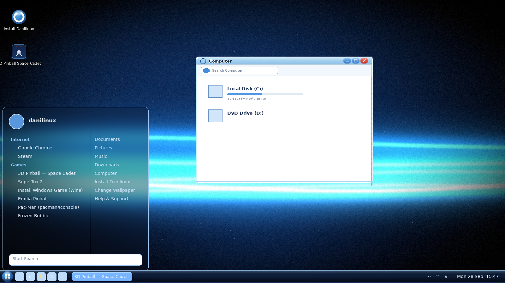

# Danilinux 2.2 — Aero Edition

A fanmade, **Windows Vista Aero**-styled Debian 13 remix with real **glass
effects** (transparency + blur), a working **installer**, Chrome, Steam, Wine
(PvZ! Peggle!) and the **original 3D Pinball: Space Cadet**.



---

## Get the ISO in 3 steps (no Linux needed, ~1 hour of waiting)

**Step 1 — Make a free GitHub account** (if you don't have one)
> Go to **github.com** → Sign up (it's free).

**Step 2 — Upload this folder to GitHub**
1. Unzip `danilinux-2.2-buildkit.zip` somewhere, then **open the
   `danilinux-2.2` folder** it created.
2. On GitHub, click the **+** (top right) → **New repository**.
3. Name it `danilinux`, pick **Public** → click **Create repository**.
4. On the new empty repo page, click the link **"uploading an existing file"**.
5. **Inside** the `danilinux-2.2` folder: select everything (**Ctrl+A**) and
   drag **the contents** — about 10 items: `.github`, `auto`, `assets`,
   `config` plus 5 files — into the browser window.
   ⚠️ Do **NOT** drag the `danilinux-2.2` folder itself! That buries everything
   one level deep and **the build will never start**. You should see
   `.github/workflows/build-iso.yml` appear in the upload list — that file is
   the build recipe.
6. Wait for the upload → click **Commit changes**.
7. **Verify before waiting:** the repo front page must show `.github`, `auto`,
   `assets`, `config`, `build.sh`... at the **top level**. If all you see is a
   single folder named `danilinux-2.2`, delete the repo
   (Settings → Danger Zone → Delete) and redo step 5.

**Step 3 — Download the ISO**
1. Uploading automatically **starts the build**. Click the **Actions** tab —
   you'll see "Build Danilinux 2.2 ISO" running (yellow dot). It takes about
   **40–90 minutes**.
2. When the dot turns **green ✔**, go back to the repo main page.
3. The ISO **never appears in the repo file list** — it lands under
   **Releases** (right-hand side) → **Danilinux 2.2 — Aero Edition**.
4. Click **`danilinux-2.2-amd64.hybrid.iso`** → it downloads (~3.5 GB). Done!

*(If the build fails or you want a smaller ISO: Actions tab → click the
workflow → "Run workflow" → untick "include firmware". The release is always
replaced with the newest build.)*

---

## Test it in VMware

- New VM → Linux → Debian 12/13 64-bit
- RAM **4 GB+** · CPU **2+ cores** · Disk **25–40 GB**
- **VM Settings → Display → tick "Accelerate 3D graphics"** ← needed for the
  Aero glass effect, Steam and the games
- Attach the ISO → Power on → it boots into the live desktop (auto-login)

### To install it to the disk (not just live boot)
Double-click **"Install Danilinux"** on the desktop → pick your language,
keyboard, timezone → erase disk (or manual partitioning) → create your user →
**Install**. When it finishes, reboot into Danilinux from the disk. The
installer, boot menus and installed system are all branded Danilinux — the
only install icon is "Install Danilinux".

---

## What's new in 2.2

| Change | Details |
|---|---|
| **Real Aero glass** | picom compositor with dual-Kawase **blur** + transparency — menus, taskbar and tooltips are genuinely see-through, wallpaper blurred behind them; soft window shadows and smooth fades |
| **New window frames** | custom `Danilinux-Aero` xfwm4 theme — light frosted-glass titlebars, glowing dark title text, glossy capsule buttons (red close, blue min/max), Vista layout |
| **Glass taskbar** | translucent gradient taskbar strip — the wallpaper shines through it |
| **Vista typography** | **Selawik** — the open-source Segoe UI-compatible font (Vista's typeface) |
| **"Install Debian" removed** | the only install entry anywhere is **Install Danilinux** |
| **Installer hardened** | installed system's boot menu says Danilinux; installer launches reliably (sudo-first); Calamares config re-verified against Debian's own settings |
| **10 wallpapers** | 2 new (Aero Ice, Aero Twilight) + the 8 from 2.1, all switchable via the Change Wallpaper app |

Everything from 2.1 is still in: Calamares installer, Steam fix (32-bit GL),
Wine + Windows-game helper, original 3D Pinball Space Cadet, quicklaunch that
works, clock + tray locked right, SuperTux icon fix, single clean taskbar.

## What's inside

**Desktop (XFCE, Vista-styled)**
- Single bottom **glass** taskbar with the Start orb (Whisker menu)
- Working quicklaunch: Terminal, Chrome, Files, Steam, 3D Pinball, Windows Games
- Clock + system tray locked to the right edge
- 10 Aero wallpapers + "Change Wallpaper" switcher
- LightDM auto-login in the live session; proper login screen after install

**Apps & games**
- **Google Chrome** (default browser)
- **Steam** — full 32-bit graphics stack preinstalled (the 1.0 "installs but
  doesn't open" bug is fixed)
- **Wine + Winetricks** — run Plants vs. Zombies, Peggle and other Windows
  games (menu → Games → **Install Windows Game (Wine)**, or double-click any
  `.exe`)
- **3D Pinball: Space Cadet — the original** (open engine + original game
  data, native)
- SuperTux, SuperTuxKart, Neverball, Extreme Tux Racer, Emilia Pinball,
  Pac-Man (pacman4console), NJam, Chromium B.S.U., Frozen Bubble, LBreakout2
- VMware tools + VirtualBox-friendly stack preinstalled

## Build it yourself (optional)

The GitHub Actions workflow above does this for you. To build locally on any
Debian 12/13 machine or VM instead: `sudo ./build.sh` (see **BUILD.md**).

## Layout of this kit

```
auto/config                    live-build parameters (Debian 13, GRUB, ...)
config/package-lists/          package sets (base/desktop/games/installer/firmware)
config/includes.chroot/        everything overlaid onto the image
  etc/skel/.config/...         taskbar + theme + WM settings (the Aero look)
  etc/xdg/danilinux-picom.conf the glass compositor settings
  etc/calamares/               installer config
  usr/local/src/               visuals theme bundle + Space Cadet engine/data
config/hooks/live/             build hooks: visuals, Steam/Chrome/Wine, icons, cleanup
config/hooks/binary/           bootloader rebranding
assets/                        GRUB splash + desktop proof image
build.sh / fetch-assets.sh / clean.sh
.github/workflows/build-iso.yml  the one-click CI build (also publishes Releases)
```

The Aero theme bundle (`usr/local/src/danilinux-visuals.tar.gz`) contains the
xfwm4 + GTK theme, taskbar glass, all wallpapers, desktop icons and the
Calamares branding — unpacked automatically during the build.

## Legal

Fanmade, personal-use project. Not affiliated with Microsoft, Google, Valve,
PopCap/EA or Debian. See `usr/share/doc/danilinux/SOURCES.md` inside the image
for component licenses. The Space Cadet data files belong to their respective
owners and are included for personal preservation/fan use.
